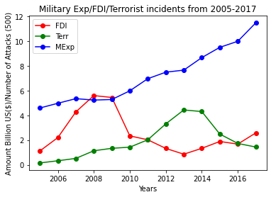

# Military Expenditures Effect on Economy of Pakistan.
To analyze the effect of military expenditures on economy of pakistan.

Firstly, analyzed the effect of terrorism attacks on the FDI growth of Pakistan. Then, compared the military expenditures data with the terrorism attacks data.

## Spearman Correlation Result Between FDI and Terrorism Data:

Correlation Score: -0.510989010989011

## Graphical Analysis:
</img>

According to the graphical results, we can see that the due to the rise in the terrorism, pakistan FDI has got declined. And, also military expenditures has got increased due to rise in terrorist attacks, so indirectly military expenditures are detrimental to pakistan economy.

All the findings of the project are available in this presentation: <a href="https://github.com/RaofaizanAPSACS/military_expenditures_effect_on_economy/blob/main/is%20military%20spending%20beneficial%20or%20detrimental%20to%20a.pptx">Powerpoint Presentation</a>